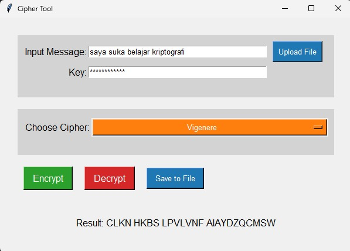
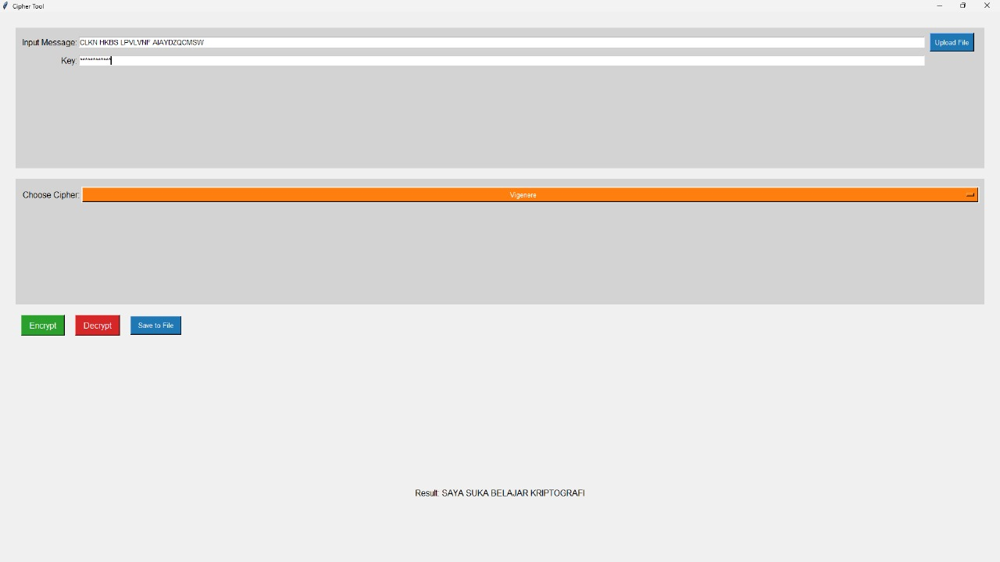
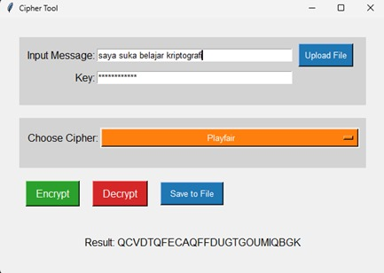
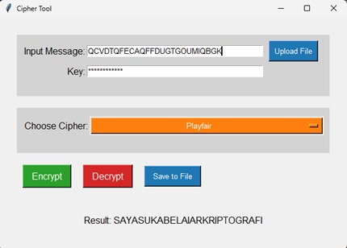
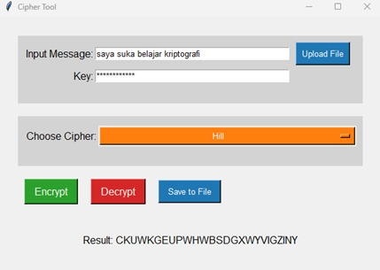
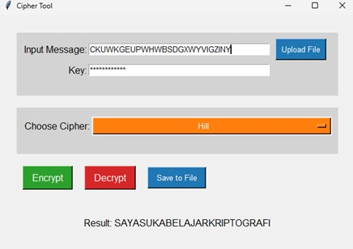

# Dokumentasi Penggunaan Cipher Tool

## Deskripsi
Cipher Tool adalah program berbasis GUI yang memungkinkan pengguna untuk melakukan enkripsi dan dekripsi menggunakan tiga metode cipher: Vigenere, Playfair, dan Hill Cipher. Program ini memungkinkan pengguna untuk memasukkan teks secara langsung atau mengunggah file teks, serta menyimpan hasil ke dalam file teks.

## Fitur
- Enkripsi dan dekripsi menggunakan:
  - Vigenere Cipher
  - Playfair Cipher
  - Hill Cipher
- Input teks dapat dilakukan langsung melalui keyboard atau dengan mengunggah file berformat `.txt`.
- Kunci untuk enkripsi dan dekripsi dapat diinputkan dan harus memiliki panjang minimal 12 karakter.
- Hasil enkripsi dan dekripsi dapat disimpan ke dalam file `.txt`.

## Persyaratan
- Python 3.x
- Modul `numpy`
- Modul `tkinter`

## Cara Menjalankan Program
1. Pastikan Anda memiliki Python 3.x terinstal di sistem Anda.
2. Instal modul yang diperlukan:
   ``` bash
   pip install numpy
3. Unduh atau salin kode sumber program.
4. Jalankan program dengan perintah
    ``` bash
    python nama_file.py
Gantilah 'nama_file.py' dengan nama file sumber program Anda.

## Penggunaan
1. Input Pesan: Masukkan pesan yang ingin dienkripsi di kolom "Input Message". Anda juga dapat mengunggah file teks dengan mengklik tombol "Upload File"
2. Input Kunci: Masukkan kunci untuk enkripsi/dekripsi di kolom "Key". Pastikan kunci memiliki panjang minimal 12 karakter.
3. Pilih Cipher: Pilih metode cipher yang ingin digunakan dari dropdown menu "Choose Cipher".
4. Enkripsi/Dekripsi: Klik tombol "Encrypt" untuk mengenkripsi pesan atau "Decrypt" untuk mendekripsi.
5. Simpan Hasil: Klik tombol "Save to File" untuk menyimpan hasil enkripsi/dekripsi ke dalam file `.txt`.

## Contoh Penggunaan Program

### Encrypt/Decrypt - Vigenere
()
<p>Pada gambar diatas terdapat plainteks "saya suka belajar kriptografi" dan dienkripsi menggunakan vigenere cipher dengan hasil yang tertera pada gambar diatas</p>
<br>

()
<p>Pada gambar diatas menunjukkan kode enkripsi yang akan di dekripsi menggunakan vigenere cipher</p>
<br>

### Encrypt/Decrypt - Playfair

<p>Pada gambar diatas terdapat plainteks "saya suka belajar kriptografi" dan dienkripsi menggunakan playfair cipher dengan hasil yang tertera pada gambar diatas</p>
<br>


<p>Pada gambar diatas menunjukkan kode enkripsi yang akan di dekripsi menggunakan playfair cipher</p>
<br>

### Encrypt/Decrypt - Hill

<p>Pada gambar diatas terdapat plainteks "saya suka belajar kriptografi" dan dienkripsi menggunakan hill cipher dengan hasil yang tertera pada gambar diatas</p>
<br>


<p>Pada gambar diatas terdapat plainteks "saya suka belajar kriptografi" dan dienkripsi menggunakan hill cipher dengan hasil yang tertera pada gambar diatas</p>
<br>